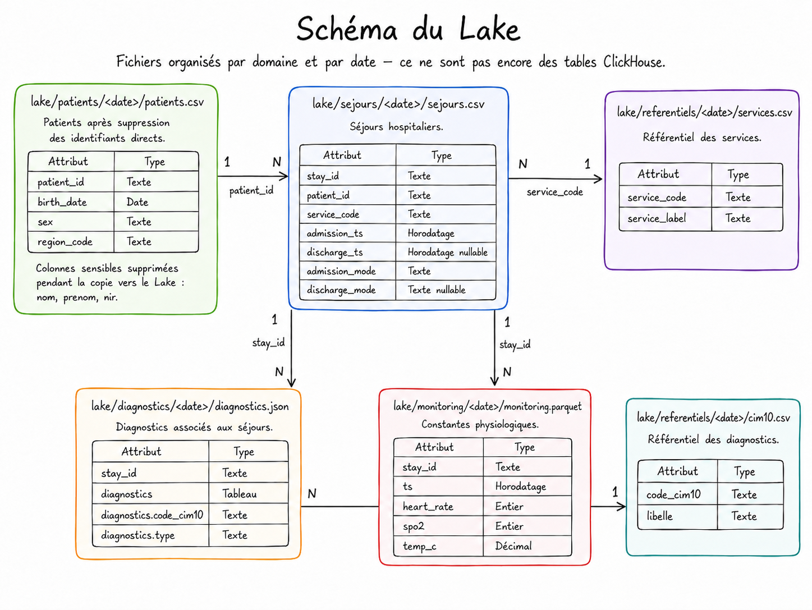
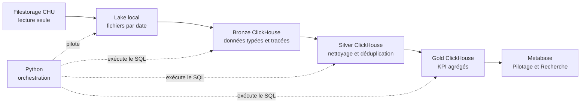
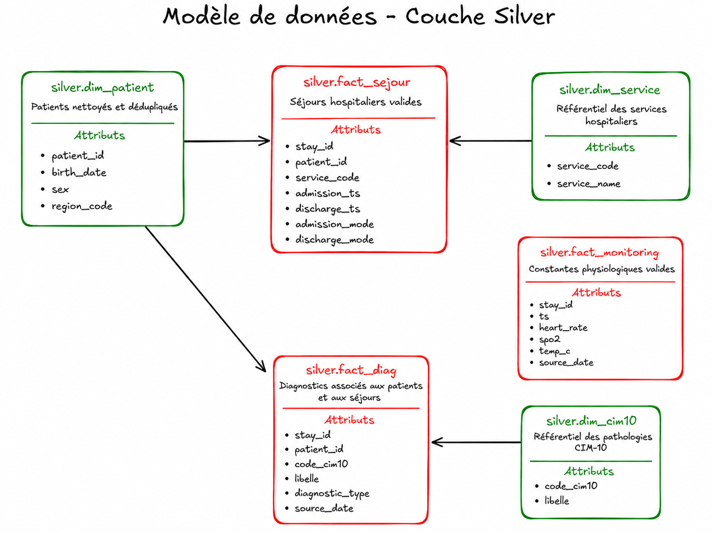
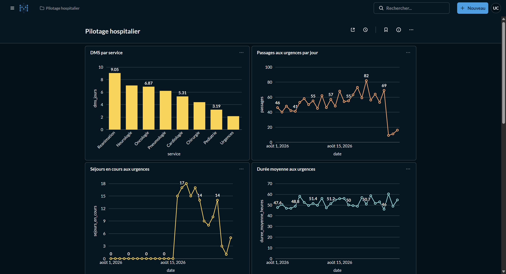
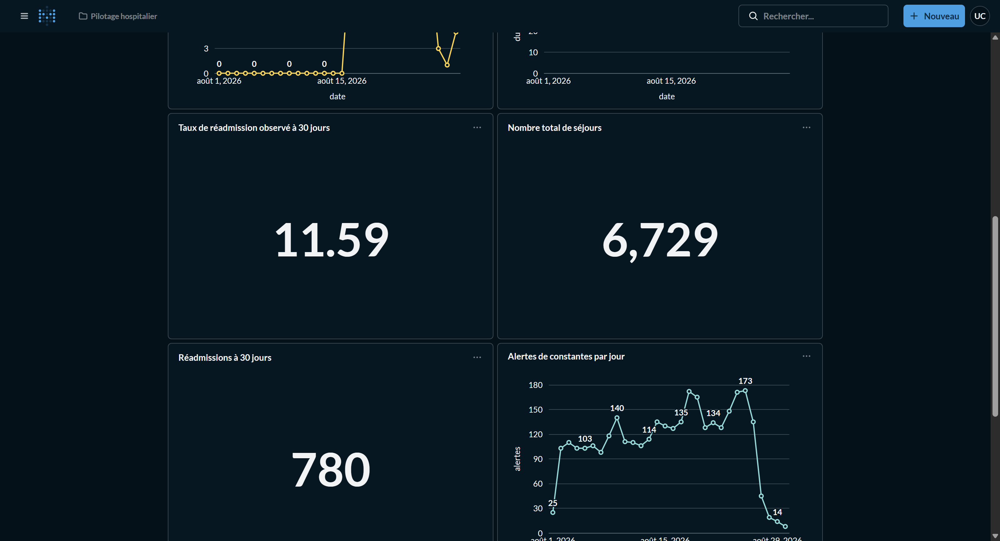
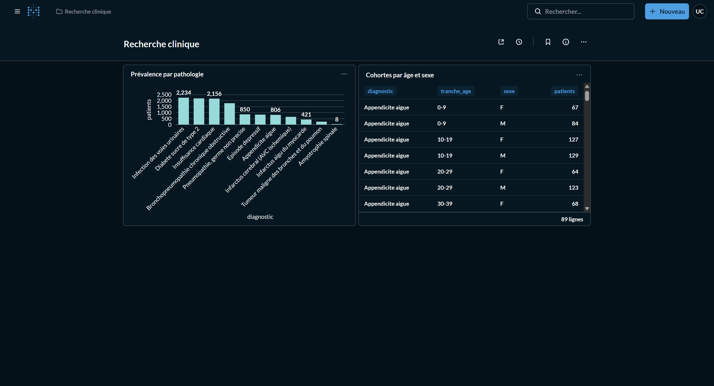

# Partie 1 - Entrepôt de données de santé et interface d'analyse

## 1. Contexte et besoin

Le Centre Hospitalier Universitaire reçoit quotidiennement des données issues de
plusieurs systèmes : dossier patient, gestion des séjours, diagnostics médicaux
et appareils de monitoring. Ces données sont déposées sous la forme de fichiers
hétérogènes, dans des formats CSV, JSON et Parquet.

Le besoin consiste à construire un Entrepôt de Données de Santé capable de
répondre à deux usages distincts :

- le **pilotage hospitalier**, destiné à la direction et aux responsables de
  services, pour suivre l'activité, la durée des séjours, les réadmissions et
  les alertes physiologiques ;
- la **recherche clinique**, destinée aux chercheurs, pour mesurer la
  prévalence des pathologies et décrire des cohortes par âge et par sexe.

La solution doit également respecter plusieurs contraintes :

- ingérer les nouveaux dépôts sans dupliquer les données déjà chargées ;
- traiter efficacement le monitoring, qui représente le volume principal ;
- détecter et écarter les données non conformes aux règles métier ;
- limiter les données conservées à ce qui est nécessaire ;
- supprimer les identifiants directs et pseudonymiser l'IPP dès l'entrée dans
  le Lake, tout en préservant les jointures entre patients et séjours ;
- empêcher les utilisateurs Pilotage et Recherche d'accéder au même périmètre ;
- savoir d'où vient chaque donnée et quand elle a été traitée.


## 2. Sources de données

Les sources sont disponibles en lecture seule dans `source-filestorage/`. Elles
sont organisées par domaine et par date de dépôt.

| Domaine | Fichier | Format | Contenu principal |
|---|---|---|---|
| Patients | `patients/<date>/patients.csv` | CSV | Identité, naissance, sexe et région |
| Séjours | `sejours/<date>/sejours.csv` | CSV | Admissions, sorties, service et modes de prise en charge |
| Diagnostics | `diagnostics/<date>/diagnostics.json` | JSON imbriqué | Codes CIM-10 principaux et associés par séjour |
| Monitoring | `monitoring/<date>/monitoring.parquet` | Parquet | Fréquence cardiaque, SpO2 et température |
| Services | `referentiels/<date>/services.csv` | CSV | Codes et libellés des services |
| CIM-10 | `referentiels/<date>/cim10.csv` | CSV | Codes et libellés des pathologies |


### 2.1 Volumes observés

Après ingestion, les principaux volumes Bronze sont les suivants :

| Table Bronze | Nombre de lignes |
|---|---:|
| `bronze.patient` | 18 000 |
| `bronze.sejour` | 6 797 |
| `bronze.diagnostic` | 12 720 |
| `bronze.monitoring` | 41 778 |
| `bronze.service` | 8 |
| `bronze.cim10` | 13 |


### 2.2 Organisation du Lake



Le Lake reproduit l'organisation quotidienne des sources. Les relations
logiques sont conservées par les identifiants : le `patient_id` pseudonymisé entre patients et
séjours, `stay_id` entre séjours, diagnostics et monitoring, `service_code`
pour le référentiel des services et `code_cim10` pour le référentiel médical.

## 3. Architecture retenue

L'architecture suit le modèle médaillon recommandé pour séparer la collecte, la
structuration, la qualité et la restitution.



### 3.1 Choix techniques

**ClickHouse** est utilisé comme entrepôt analytique. Son stockage colonnaire
est adapté aux agrégations et au volume du monitoring. Les tables `MergeTree`
permettent d'ordonner les données selon leurs clés d'accès et de traiter les
calculs au plus près du stockage.

**Python** assure la copie des fichiers, l'ordre d'exécution, les reprises et la
journalisation. Il ne réalise pas les transformations métier en mémoire : il
transmet les scripts SQL à ClickHouse. Cette séparation permet de conserver un
pipeline lisible tout en bénéficiant des capacités du moteur.

**Metabase** fournit une interface sans développement frontend spécifique. Il
permet de créer des graphiques, des tableaux et des indicateurs numériques,
mais aussi de définir des groupes et des collections avec des droits distincts.

**Docker** rend ClickHouse et Metabase reproductibles sur un poste local. La
configuration Metabase est stockée dans le volume nommé `metabase-data`, ce qui
permet de supprimer et recréer le conteneur sans perdre les comptes, les droits
ou les dashboards.

### 3.2 Justification des couches

Chaque couche répond à une responsabilité unique :

| Couche | Responsabilité | Pourquoi la séparer ? |
|---|---|---|
| Lake | Copie des dépôts par date | Protéger la source en lecture seule et permettre une reprise |
| Bronze | Typage et traçabilité | Uniformiser les formats sans mélanger ingestion et règles métier |
| Silver | Qualité et modèle analytique | Centraliser les règles de nettoyage et fournir des données fiables |
| Gold | Calcul des indicateurs | Stabiliser les définitions métier et accélérer les dashboards |
| Metabase | Visualisation et contrôle d'accès | Adapter la restitution aux deux publics sans exposer les couches techniques |

Cette séparation facilite le diagnostic d'une erreur. Une anomalie de copie se
traite dans le Lake, une erreur de format dans Bronze, une règle de qualité dans
Silver et une définition d'indicateur dans Gold.

## 4. Traitements réalisés

### 4.1 Lake : collecte et réduction des données sensibles

Le script `scripts/copy_to_lake.py` copie les partitions depuis le filestorage
sans modifier les fichiers sources.

Les traitements réalisés sont les suivants :

- reproduction de l'arborescence `<domaine>/<AAAA-MM-JJ>/` ;
- copie des fichiers CSV, JSON et Parquet dans leur format d'origine ;
- suppression de `nom`, `prenom` et `nir` avant l'écriture de
  `patients.csv` dans le Lake ;
- remplacement de `patient_id` par un HMAC-SHA-256 déterministe dans les
  fichiers patients et séjours ;
- création d'un marqueur `_INCOMPLETE` pendant la copie ;
- remplacement par `_SUCCESS` uniquement lorsque la partition est complète ;
- ignorance des partitions déjà munies de `_SUCCESS`.

La suppression des identifiants directs et le remplacement de l'IPP par un
pseudonyme stable empêchent leur propagation vers ClickHouse. Le même IPP
produit le même HMAC dans les deux domaines, ce qui préserve les jointures sans
permettre de retrouver l'identifiant source à partir du pseudonyme. Les marqueurs évitent
qu'une partition partiellement copiée soit prise pour une partition valide et
permettent de reprendre automatiquement après une interruption.

### 4.2 Bronze : structuration et traçabilité

Le script `sql/bronze.sql` transforme les fichiers du Lake en six tables
ClickHouse typées :

- `bronze.patient` ;
- `bronze.sejour` ;
- `bronze.diagnostic` ;
- `bronze.monitoring` ;
- `bronze.service` ;
- `bronze.cim10`.

Cette couche réalise peu de transformations métier. Son objectif est de rendre
les données interrogeables tout en restant proche des fichiers reçus.

Les opérations importantes sont :

- typage des dates, horodatages, entiers et décimaux ;
- utilisation de `Date32` pour les dates de naissance antérieures à 1970 ;
- éclatement du tableau JSON `diagnostics` avec `ARRAY JOIN` ;
- ajout de `source_date`, extrait du chemin de la partition ;
- ajout de `source_file`, qui conserve le chemin d'origine ;
- ajout de `ingested_at`, qui indique l'instant de chargement ;
- chargement uniquement des chemins absents de `source_file`.

Le contrôle sur `source_file` rend l'ingestion incrémentale et évite de
dupliquer un fichier lors d'une nouvelle exécution.

### 4.3 Silver : nettoyage et modèle analytique



La couche Silver contient trois dimensions et trois tables de faits :

| Table | Rôle | Clés logiques principales |
|---|---|---|
| `silver.dim_patient` | Patients nettoyés et dédupliqués | `patient_id` |
| `silver.dim_service` | Référentiel des services | `service_code` |
| `silver.dim_cim10` | Référentiel des pathologies | `code_cim10` |
| `silver.fact_sejour` | Séjours hospitaliers valides | `stay_id`, `patient_id`, `service_code` |
| `silver.fact_diag` | Diagnostics par patient et séjour | `stay_id`, `patient_id`, `code_cim10` |
| `silver.fact_monitoring` | Constantes physiologiques valides | `stay_id`, `ts` |

ClickHouse ne crée pas de clés étrangères physiques. Les relations sont
construites par les jointures SQL et contrôlées pendant les transformations.

#### Patients

Les 18 000 lignes Bronze correspondent à plusieurs photographies quotidiennes
des mêmes patients. Elles sont dédupliquées avec `argMax` en conservant la
version la plus récente selon `source_date` et `ingested_at`. Le sexe est limité
aux valeurs normalisées `M` et `F`. Le résultat contient 6 000 patients.

Le type `Date32` est nécessaire pour conserver correctement les dates de
naissance anciennes. Le type `Date` standard de ClickHouse commence en 1970 et
aurait faussé les distributions d'âge des cohortes.

#### Séjours

Les séjours sont dédupliqués par `stay_id`. Un séjour est écarté lorsque sa date
de sortie précède sa date d'admission. Une sortie vide reste valide, car elle
représente un patient toujours hospitalisé.

Le passage de 6 797 lignes Bronze à 6 729 séjours Silver correspond exactement
aux 68 séjours présentant une incohérence temporelle.

#### Diagnostics

Les diagnostics sont dédupliqués selon le triplet `stay_id`, `code_cim10` et
`diagnostic_type`. Ils sont enrichis avec le libellé CIM-10 et le `patient_id`
du séjour. Le type distingue le diagnostic `principal` des diagnostics
`associe`.

Les diagnostics sont conservés indépendamment du contrôle temporel appliqué à
`fact_sejour`. Ils restent exploitables pour les comptages de prévalence et
permettent de reproduire les cohortes de référence du jeu de données.

#### Monitoring

Les mesures sont identifiées par le couple `stay_id`, `ts`. Les valeurs hors
des plages physiologiques de validité sont écartées :

- fréquence cardiaque entre 20 et 250 bpm ;
- SpO2 entre 50 et 100 % ;
- température entre 30 et 45 °C.

Ces limites sont des contrôles de qualité, et non les seuils d'alerte clinique.
Elles retirent les valeurs manifestement impossibles tout en conservant les
mesures anormales utiles au pilotage.

Sur 41 778 mesures Bronze, 858 sont écartées et 40 920 sont conservées dans
Silver.

#### Résultats des contrôles Silver

| Domaine | Bronze | Silver | Résultat |
|---|---:|---:|---|
| Patients | 18 000 | 6 000 | Déduplication des photographies quotidiennes |
| Séjours | 6 797 | 6 729 | 68 incohérences temporelles écartées |
| Monitoring | 41 778 | 40 920 | 858 valeurs physiologiquement impossibles écartées |

### 4.4 Gold : indicateurs métier

La couche Gold ne contient plus de données détaillées directement exploitables
pour identifier un patient. Elle contient des résultats agrégés adaptés aux
deux usages métier.

À chaque exécution, les petites tables Gold sont recalculées avec `TRUNCATE`
puis `INSERT`. Cette stratégie évite de mélanger deux versions d'un indicateur
et reste peu coûteuse, car les volumes Gold sont faibles.

#### Indicateurs de pilotage

##### Durée moyenne de séjour par service

La DMS est calculée uniquement sur les séjours terminés :

```text
DMS = moyenne(date de sortie - date d'admission)
```

| Service | Séjours clos | DMS en jours |
|---|---:|---:|
| Réanimation | 423 | 9,05 |
| Neurologie | 1 077 | 7,06 |
| Oncologie | 185 | 6,87 |
| Pneumologie | 753 | 6,20 |
| Cardiologie | 1 459 | 5,31 |
| Chirurgie | 424 | 4,39 |
| Pédiatrie | 448 | 3,19 |
| Urgences | 1 277 | 2,15 |

##### Activité des urgences

L'activité est définie par les séjours dont `service_code = 'URGENCES'`, et non
par le seul mode d'admission. La table contient, pour chaque date :

- le nombre de passages ;
- le nombre de séjours encore en cours ;
- la durée moyenne des séjours terminés.

Du 1er au 28 août 2026, 1 423 passages sont comptabilisés.

##### Réadmissions à 30 jours

Un séjour est une réadmission lorsqu'une sortie antérieure du même patient a eu
lieu dans les 30 jours précédant sa nouvelle admission. Un même séjour n'est
compté qu'une fois, même si plusieurs séjours antérieurs correspondent.

```text
Taux = 780 réadmissions / 6 729 séjours × 100 = 11,59 %
```

##### Alertes des constantes

Après le contrôle de qualité Silver, un relevé déclenche une alerte si au moins
une condition est vraie :

- fréquence cardiaque inférieure à 50 ou supérieure à 100 bpm ;
- SpO2 inférieure à 92 % ;
- température supérieure à 38,5 °C.

Les 40 920 relevés valides contiennent 3 314 relevés en alerte, soit 8,1 % sur
l'ensemble de la période. Le taux quotidien est arrondi à une décimale.

#### Indicateurs de recherche clinique

##### Prévalence par pathologie

La taille d'une cohorte correspond au nombre de patients distincts possédant le
code CIM-10, que le diagnostic soit principal ou associé.

| Code | Pathologie | Patients diffusés |
|---|---|---:|
| N39 | Infection des voies urinaires | 2 234 |
| E11 | Diabète sucré de type 2 | 2 177 |
| I50 | Insuffisance cardiaque | 2 156 |
| J44 | Bronchopneumopathie chronique obstructive | 1 775 |
| J18 | Pneumopathie, germe non précisé | 850 |
| F32 | Épisode dépressif | 827 |
| K35 | Appendicite aiguë | 806 |
| I63 | Infarctus cérébral | 643 |
| I21 | Infarctus aigu du myocarde | 421 |
| C34 | Tumeur maligne des bronches et du poumon | 239 |
| G12 | Amyotrophie spinale | 8 |

Les cohortes E84, avec quatre patients, et Q90, avec trois patients, ne sont pas
publiées.

##### Distribution des cohortes par âge et sexe

La description détaillée utilise uniquement le diagnostic principal. Chaque
patient n'est compté qu'une fois par pathologie. L'âge est calculé à partir de
l'année maximale observée dans les séjours et de l'année de naissance, puis
regroupé en tranches décennales : `0-9`, `10-19`, jusqu'à `90-99`.

Le seuil de diffusion est appliqué à chaque combinaison pathologie, tranche
d'âge et sexe. La table Gold contient 89 cellules diffusables et sa plus petite
valeur est exactement 5.

## 5. Interface Metabase et visualisations

L'interface est disponible à l'adresse `http://localhost:3000`. Elle contient
deux collections et deux dashboards adaptés aux publics concernés.

### 5.1 Dashboard Pilotage hospitalier

Le dashboard de pilotage présente :

- un diagramme en barres de la DMS par service ;
- une courbe des passages aux urgences par jour ;
- une courbe des séjours encore en cours aux urgences ;
- une courbe de la durée moyenne aux urgences ;
- trois cartes numériques pour le taux de réadmission, le nombre total de
  séjours et le nombre de réadmissions ;
- une courbe du nombre d'alertes physiologiques par jour ;
- une courbe du taux quotidien d'alerte.

Les graphiques temporels permettent de repérer rapidement une hausse d'activité
ou une journée atypique. Les cartes numériques rendent les indicateurs qualité
immédiatement lisibles.



*Capture du dashboard Pilotage : DMS par service et activité quotidienne des
urgences.*

La DMS varie fortement selon les services : elle atteint 9,05 jours en
réanimation, contre 2,15 jours aux urgences. Cet écart est cohérent avec des
prises en charge de nature et de gravité différentes ; il ne doit donc pas être
interprété seul comme un classement de performance. Les urgences totalisent
1 423 passages sur la période, avec un maximum quotidien visible de 82. La
baisse sur les derniers jours doit être rapprochée de la complétude des dépôts
avant de conclure à une baisse réelle de l'activité.



*Capture des KPI de réadmission à 30 jours et des alertes physiologiques.*

Le dashboard affiche 780 réadmissions parmi 6 729 séjours, soit un taux observé
de 11,59 %. Cette valeur constitue un indicateur de surveillance : son
interprétation clinique nécessiterait une comparaison par service, pathologie et
niveau de risque. Les alertes atteignent un pic quotidien de 173. Leur baisse en
fin de période ne suffit pas à conclure à une amélioration, car le nombre de
relevés disponibles diminue également ; le taux d'alerte doit être analysé avec
le volume quotidien de monitoring.

### 5.2 Dashboard Recherche clinique

Le dashboard de recherche présente :

- un diagramme en barres de la taille des cohortes par pathologie ;
- un tableau détaillé par diagnostic principal, tranche d'âge et sexe.

Le graphique facilite la comparaison des prévalences. Le tableau conserve le
niveau de détail nécessaire à la description des cohortes tout en respectant le
seuil minimal de cinq patients.



*Capture du dashboard Recherche : prévalence des pathologies et détail des
cohortes diffusables par âge et sexe.*

Les cohortes les plus importantes concernent l'infection des voies urinaires
(2 234 patients), le diabète de type 2 (2 177) et l'insuffisance cardiaque
(2 156). Ces effectifs ne doivent pas être additionnés, car un patient peut
appartenir à plusieurs cohortes. Le tableau détaille 89 combinaisons
pathologie-âge-sexe. Toutes comptent au moins cinq patients : les petites
cohortes E84 (quatre patients) et Q90 (trois patients) restent exclues afin de
réduire le risque de réidentification.

### 5.3 Cloisonnement des droits

Le cloisonnement est appliqué à deux niveaux.

Dans Metabase :

- le groupe `Pilotage hospitalier` peut lire uniquement la collection et le
  dashboard Pilotage ;
- le groupe `Recherche clinique` peut lire uniquement la collection et le
  dashboard Recherche ;
- l'accès direct à l'URL de l'autre dashboard retourne un refus d'autorisation ;
- l'administrateur conserve les droits de création et de maintenance.

Dans ClickHouse :

- `metabase_pilotage` possède seulement `SELECT` sur les quatre tables Gold de
  pilotage ;
- `metabase_recherche` possède seulement `SELECT` sur les deux tables Gold de
  recherche ;
- aucun de ces comptes n'accède aux données détaillées Bronze ou Silver.

Cette défense en profondeur limite l'impact d'une erreur de configuration dans
l'outil de visualisation. Le script `scripts/verify_metabase.py` vérifie que
chaque compte voit son dashboard et reçoit une erreur HTTP 403 sur l'autre.

## 6. Fiabilité et validation des résultats

Les résultats ont été comparés à la feuille de référence
`REPONSES-KPI-niveau1.pdf`.

Les contrôles réalisés confirment :

- les volumes Bronze et Silver exacts ;
- les huit DMS exactes ;
- 780 réadmissions et un taux de 11,59 % ;
- aucune différence sur les 28 lignes quotidiennes des urgences ;
- aucune différence sur les 30 lignes quotidiennes du monitoring ;
- les onze cohortes de prévalence diffusables exactes ;
- 89 cellules âge-sexe, sans effectif inférieur à cinq.

Les tests Python vérifient également la collecte incrémentale, l'absence de
publication d'une partition incomplète et le verrou contre deux exécutions
concurrentes.

## 7. Traçabilité et exploitation

La traçabilité est assurée à plusieurs niveaux :

- `source_date`, `source_file` et `ingested_at` dans Bronze ;
- `source_date` dans les faits Silver concernés ;
- `calculated_at` dans chaque table Gold ;
- `logs/pipeline.log` pour les messages techniques ;
- `audit.pipeline_runs` pour l'état global de chaque exécution ;
- `audit.pipeline_stages` pour le détail de chaque étape.

Le pipeline complet est lancé avec :

```console
python scripts/run_pipeline.py
```

L'ordre imposé `collecte → bronze → silver → gold` empêche le calcul d'un KPI à
partir d'une couche incomplète. En cas d'incident, l'option `--start-at` permet
de reprendre à l'étape Bronze, Silver ou Gold.

## 8. Limites

### 8.1 Gestion simplifiée du secret HMAC

Les identifiants `nom`, `prenom` et `nir` sont supprimés et `patient_id` est
pseudonymisé avant l'entrée dans le Lake. Pour les besoins de l'exercice, la clé
HMAC est toutefois déclarée directement dans le code. Une personne ayant accès
au dépôt pourrait donc recalculer les pseudonymes à partir d'un IPP connu. En
production, cette clé doit impérativement être stockée hors du code et du dépôt
Git, dans un gestionnaire de secrets ou une variable d'environnement protégée.

### 8.2 Déploiement local

La solution utilise Docker Desktop, un planificateur Windows et la base H2
embarquée de Metabase. Cette configuration est adaptée à une démonstration sur
un ordinateur, mais pas à une exploitation hospitalière distribuée ou à haute
disponibilité.

### 8.3 Absence de clés étrangères physiques

ClickHouse privilégie les performances analytiques et n'impose pas les
relations avec des clés étrangères. Une erreur dans une transformation pourrait
donc produire un enregistrement orphelin si les contrôles SQL ne sont pas
maintenus.

### 8.4 Recalcul Gold non transactionnel

Les tables Gold sont recalculées séparément. ClickHouse ne fournit pas de
transaction unique couvrant toutes les tables. Une erreur au milieu du calcul
peut temporairement laisser des KPI provenant de deux exécutions différentes ;
la reprise consiste à relancer entièrement l'étape Gold.

## 9. Recommandations

1. Déplacer la clé HMAC d'exercice vers un gestionnaire de secrets et mettre en
   place une procédure contrôlée de rotation de clé.
2. Généraliser la naissance à l'année lorsque la date exacte n'est pas
   nécessaire à l'usage autorisé.
3. Utiliser PostgreSQL comme base applicative Metabase pour un déploiement
   durable et sauvegardable.
4. Activer TLS entre les utilisateurs, Metabase et ClickHouse, puis gérer les
   secrets avec un coffre dédié.
5. Centraliser les journaux et ajouter des alertes sur les échecs, les volumes
   anormaux et les retards de dépôt.
6. Ajouter des tests automatiques de non-régression pour chaque KPI et pour les
   règles de qualité Silver.
7. Mettre en place une procédure de revue et de validation métier avant toute
   modification des seuils ou des définitions d'indicateurs.
8. Compléter le seuil de cinq par une analyse du risque de réidentification et
   par des restrictions d'export adaptées aux chercheurs.
9. Supprimer la base et la collection d'exemple Metabase avant un déploiement
   hors démonstration.
10. Prévoir des sauvegardes régulières des volumes ClickHouse et de la base
    applicative Metabase, avec des tests de restauration.

## 10. Conclusion

L'architecture médaillon fournit une chaîne lisible et vérifiable depuis les
fichiers quotidiens jusqu'aux dashboards. Le Lake sécurise la collecte, Bronze
structure et trace les sources, Silver applique les règles de qualité, Gold
stabilise les calculs métier et Metabase restitue les résultats selon des droits
cloisonnés.

Les indicateurs obtenus correspondent aux valeurs de référence. La solution
répond donc aux besoins fonctionnels de pilotage et de recherche pour la
démonstration. Les principaux chantiers avant une utilisation réelle restent la
gestion sécurisée du secret HMAC et le renforcement de l'infrastructure de
sécurité et de haute disponibilité.
